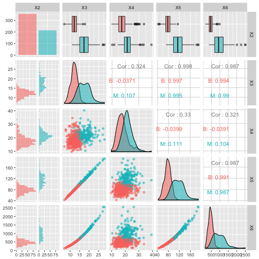

---
# Please do not edit this file directly; it is auto generated.
# Instead, please edit 01-Loading_Exploring.md in _episodes_rmd/
title: "Loading and exploring data"
author: "Hugo Bowne-Anderson, Jorge Perez de Acha Chavez"
teaching: 20
exercises: 10
questions: 
- "What is Exploratory Data Analysis (EDA) and why is it useful?"
- "How can I do EDA in R?"
objectives: 
- "Use `caret` to preprocess data."
keypoints: 
- "Plots are always useful tools for getting to know your data."
- "Center and scale your numerical variables using the `caret` package."
output: html_document
---

> ## Setting up
> Make sure you have installed R and RStudio, and installed and loaded the necessary packages from the [Setup]({{ page.root }}) section.
>
{: .prereq}

## Loading your data

It's time to import the first dataset that we'll work with, the [Breast Cancer Wisconsin (Diagnostic) Data Set](http://archive.ics.uci.edu/ml/datasets/breast+cancer+wisconsin+%28diagnostic%29) from the UCI Machine Learning repository.

Do this and check out the first several rows:

~~~
# Load data
df <- read_csv("https://archive.ics.uci.edu/ml/machine-learning-databases/breast-cancer-wisconsin/wdbc.data",
               col_names = FALSE)
# Check out head of dataframe
df %>% head()
~~~
{: .language-r}

~~~
# A tibble: 6 x 32
        X1 X2       X3    X4    X5    X6     X7     X8     X9    X10   X11
     <int> <chr> <dbl> <dbl> <dbl> <dbl>  <dbl>  <dbl>  <dbl>  <dbl> <dbl>
1   842302 M      18.0  10.4 123.  1001  0.118  0.278  0.300  0.147  0.242
2   842517 M      20.6  17.8 133.  1326  0.0847 0.0786 0.0869 0.0702 0.181
3 84300903 M      19.7  21.2 130   1203  0.110  0.160  0.197  0.128  0.207
4 84348301 M      11.4  20.4  77.6  386. 0.142  0.284  0.241  0.105  0.260
5 84358402 M      20.3  14.3 135.  1297  0.100  0.133  0.198  0.104  0.181
6   843786 M      12.4  15.7  82.6  477. 0.128  0.17   0.158  0.0809 0.209
# ... with 21 more variables: X12 <dbl>, X13 <dbl>, X14 <dbl>, X15 <dbl>,
#   X16 <dbl>, X17 <dbl>, X18 <dbl>, X19 <dbl>, X20 <dbl>, X21 <dbl>,
#   X22 <dbl>, X23 <dbl>, X24 <dbl>, X25 <dbl>, X26 <dbl>, X27 <dbl>,
#   X28 <dbl>, X29 <dbl>, X30 <dbl>, X31 <dbl>, X32 <dbl>
~~~
{: .output}
> ## Discussion
>
> What are the variables in the dataset? Follow the link to UCI above to find out.
>
{: .discussion}

Before thinking about modeling, have a look at your data. There's no point in throwing a $10^4$ layer convolutional neural network (whatever that means) at your data before you even know what you're dealing with.

You'll first remove the first column, which is the unique identifier of each row:

~~~
# Remove first column 
df <- df[2:32]
# View head
df %>% head()
~~~
{: .language-r}

~~~
# A tibble: 6 x 31
  X2       X3    X4    X5    X6     X7     X8     X9    X10   X11    X12
  <chr> <dbl> <dbl> <dbl> <dbl>  <dbl>  <dbl>  <dbl>  <dbl> <dbl>  <dbl>
1 M      18.0  10.4 123.  1001  0.118  0.278  0.300  0.147  0.242 0.0787
2 M      20.6  17.8 133.  1326  0.0847 0.0786 0.0869 0.0702 0.181 0.0567
3 M      19.7  21.2 130   1203  0.110  0.160  0.197  0.128  0.207 0.0600
4 M      11.4  20.4  77.6  386. 0.142  0.284  0.241  0.105  0.260 0.0974
5 M      20.3  14.3 135.  1297  0.100  0.133  0.198  0.104  0.181 0.0588
6 M      12.4  15.7  82.6  477. 0.128  0.17   0.158  0.0809 0.209 0.0761
# ... with 20 more variables: X13 <dbl>, X14 <dbl>, X15 <dbl>, X16 <dbl>,
#   X17 <dbl>, X18 <dbl>, X19 <dbl>, X20 <dbl>, X21 <dbl>, X22 <dbl>,
#   X23 <dbl>, X24 <dbl>, X25 <dbl>, X26 <dbl>, X27 <dbl>, X28 <dbl>,
#   X29 <dbl>, X30 <dbl>, X31 <dbl>, X32 <dbl>
~~~
{: .output}

> ## Question
>
> How many features are there in this dataset?
>
{: .challenge}

> ## Discussion
>
> Why did we want to remove the unique identifier?
>
{: .discussion}

Now there are too many features to plot so you'll plot the first 5 in a pair-plot:
<!-- does this mean we're getting rid of features, or that we'll only plot the first five as opposed to the 32 -->

~~~
# Pair-plot of first 5 features
ggpairs(df[1:5], aes(colour=X2, alpha=0.4))
~~~
{: .language-r}

~~~
`stat_bin()` using `bins = 30`. Pick better value with `binwidth`.
`stat_bin()` using `bins = 30`. Pick better value with `binwidth`.
`stat_bin()` using `bins = 30`. Pick better value with `binwidth`.
`stat_bin()` using `bins = 30`. Pick better value with `binwidth`.
~~~
{: .output}

> ## Discussion
>
> What can you see here?
>
{: .discussion}

Note that the features have widely varying centers and scales (means and standard deviations) so we'll want to center and scale them in some situations. You'll use the caret package for this. You can read more about preprocessing with caret [here](https://topepo.github.io/caret/pre-processing.html#pp).
<!-- it is not entirely clear why it's necessary to perform scaling and centering.
perhaps briefly mention the other situations when center and scaling is not necessary? --> 

~~~
# Center & scale data
ppv <- preProcess(df, method = c("center", "scale"))
df_tr <- predict(ppv, df)
# Summarize first 5 columns
df_tr[1:5] %>% summary()
~~~
{: .language-r}

~~~
      X2                  X3                X4                X5         
 Length:569         Min.   :-2.0279   Min.   :-2.2273   Min.   :-1.9828  
 Class :character   1st Qu.:-0.6888   1st Qu.:-0.7253   1st Qu.:-0.6913  
 Mode  :character   Median :-0.2149   Median :-0.1045   Median :-0.2358  
                    Mean   : 0.0000   Mean   : 0.0000   Mean   : 0.0000  
                    3rd Qu.: 0.4690   3rd Qu.: 0.5837   3rd Qu.: 0.4992  
                    Max.   : 3.9678   Max.   : 4.6478   Max.   : 3.9726  
       X6         
 Min.   :-1.4532  
 1st Qu.:-0.6666  
 Median :-0.2949  
 Mean   : 0.0000  
 3rd Qu.: 0.3632  
 Max.   : 5.2459  
~~~
{: .output}

Now plot the centered & scaled features:

~~~
# Pair-plot of transformed data
ggpairs(df_tr[1:5], aes(colour=X2))
~~~
{: .language-r}

~~~
`stat_bin()` using `bins = 30`. Pick better value with `binwidth`.
`stat_bin()` using `bins = 30`. Pick better value with `binwidth`.
`stat_bin()` using `bins = 30`. Pick better value with `binwidth`.
`stat_bin()` using `bins = 30`. Pick better value with `binwidth`.
~~~
{: .output}

> ## Discussion
>
> How does this compare to your previous pairplot?
>
{: .discussion}
