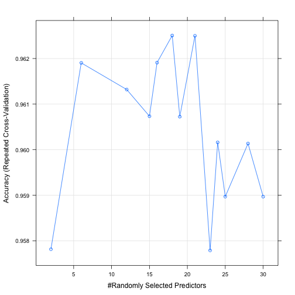

---
# Please do not edit this file directly; it is auto generated.
# Instead, please edit 03-Supervised-Learning-I.md in _episodes_rmd/
title: 'Supervised Learning I: classification'
author: "Hugo Bowne-Anderson, Jorge Perez de Acha Chavez"
teaching: 20
exercises: 10
questions: 
- "How can I apply supervised learning to a data set?"
objectives: 
- "Know the basic Machine Learning terminology."
- "Build a model to predict a categorical target variable."
- "Apply logistic regression and random forests algorithms to a data set and compare them."
- "Learn the importance of separating data into training and test sets."
keypoints: 
- "The _target variable_ is the variable of interest, while the rest of the variables are known as _features_ or _predictor variables_."
- "Separate your data set into training and test sets to avoid overfitting."
- "Logistic regression and random forests can be used to predict categorical variables."
output: html_document
---

## Supervised Learning I: classification

As mentioned in passing before: *Supervised learning*, is the branch of machine learning that involves predicting labels, such as whether a tumour will be *benign* or *malignant*.

In this section, you'll attempt to predict tumour diagnosis based on geometrical measurements.

> ## Discussion
>
> Look at your [pair plot]({{ page.root }}). What would a baseline model there be?
>
{: .discussion}

> ## Exercise
>
> Build a model that predicts diagnosis based on whether `X3 > 15` or something similar.
>> ## Solution
>> 
>> ~~~
>> # Build baseline model
>> df$pred <- ifelse(df$X3 > 15, "M", "B")
>> df$pred
>> ~~~
>> {: .language-r}
>{: .solution}
{: .challenge}

This is not a great model but it does give us a baseline: any model that we build later needs to perform better than this one.

Whoa: what do we mean by _model performance_ here? There are many _metrics_ to determine model performance and here we'll use _accuracy_, the percentage of the data that the model got correct.

> ## Note on terminology
>
> - The _target variable_ is the one you are trying to predict;
> - Other variables are known as _features_ (or _predictor variables_).
>
{: .callout}

We first need to change `df$X2`, the _target variable_, to a factor:

~~~
# What is the class of X2?
class(df$X2)
~~~
{: .language-r}

~~~
[1] "character"
~~~
{: .output}

~~~
# Change it to a factor
df$X2 <- as.factor(df$X2)
# What is the class of X2 now?
class(df$X2)
~~~
{: .language-r}

~~~
[1] "factor"
~~~
{: .output}

Calculate baseline model accuracy:

~~~
  [1] "M" "M" "M" "B" "M" "B" "M" "B" "B" "B" "M" "M" "M" "M" "B" "B" "B"
 [18] "M" "M" "B" "B" "B" "M" "M" "M" "M" "B" "M" "M" "M" "M" "B" "M" "M"
 [35] "M" "M" "B" "B" "B" "B" "B" "B" "M" "B" "B" "M" "B" "B" "B" "B" "B"
 [52] "B" "B" "M" "M" "B" "M" "B" "B" "B" "B" "B" "B" "B" "B" "B" "B" "B"
 [69] "B" "B" "M" "B" "M" "B" "B" "M" "B" "M" "M" "B" "B" "B" "M" "M" "B"
 [86] "M" "B" "M" "B" "B" "B" "M" "B" "B" "M" "M" "B" "B" "B" "B" "B" "B"
[103] "B" "B" "B" "B" "B" "B" "M" "B" "B" "B" "B" "B" "B" "B" "B" "B" "M"
[120] "M" "B" "M" "M" "B" "B" "B" "B" "M" "M" "M" "B" "M" "M" "M" "M" "B"
[137] "B" "B" "B" "B" "B" "M" "B" "B" "B" "B" "B" "B" "B" "B" "B" "B" "B"
[154] "B" "B" "B" "M" "M" "B" "B" "B" "M" "M" "B" "M" "B" "B" "M" "M" "B"
[171] "B" "B" "M" "B" "B" "B" "B" "M" "B" "B" "M" "M" "M" "B" "M" "B" "M"
[188] "B" "B" "B" "B" "B" "B" "B" "B" "B" "B" "M" "M" "B" "B" "M" "M" "B"
[205] "B" "M" "B" "M" "B" "M" "M" "B" "M" "M" "B" "B" "B" "B" "M" "M" "B"
[222] "B" "B" "M" "B" "B" "B" "B" "B" "B" "M" "B" "B" "M" "B" "B" "M" "M"
[239] "B" "M" "B" "B" "B" "B" "M" "B" "B" "B" "B" "B" "M" "B" "M" "M" "M"
[256] "B" "M" "M" "M" "M" "M" "M" "M" "M" "M" "M" "B" "B" "B" "B" "B" "B"
[273] "M" "B" "M" "B" "B" "M" "B" "B" "M" "B" "M" "M" "B" "B" "B" "B" "B"
[290] "B" "B" "B" "B" "B" "B" "B" "B" "B" "B" "B" "M" "B" "M" "B" "B" "B"
[307] "B" "B" "B" "B" "B" "B" "B" "B" "B" "B" "B" "M" "B" "B" "B" "M" "B"
[324] "M" "B" "B" "B" "B" "M" "M" "M" "B" "B" "B" "B" "M" "B" "M" "B" "M"
[341] "B" "B" "B" "M" "B" "B" "B" "B" "B" "B" "B" "M" "M" "M" "B" "B" "B"
[358] "B" "B" "B" "B" "B" "B" "M" "B" "M" "M" "B" "M" "M" "M" "M" "M" "M"
[375] "B" "M" "B" "B" "B" "B" "B" "B" "B" "B" "B" "B" "B" "B" "B" "M" "B"
[392] "B" "M" "M" "B" "B" "B" "B" "B" "B" "M" "B" "B" "B" "B" "B" "M" "B"
[409] "M" "B" "B" "B" "B" "B" "M" "B" "B" "M" "B" "B" "B" "B" "B" "B" "B"
[426] "B" "B" "B" "B" "B" "B" "B" "M" "M" "B" "B" "B" "B" "B" "B" "B" "M"
[443] "B" "B" "M" "B" "M" "B" "B" "M" "B" "M" "B" "B" "B" "B" "B" "B" "B"
[460] "B" "M" "M" "B" "B" "B" "B" "B" "B" "M" "B" "B" "B" "B" "B" "B" "B"
[477] "B" "B" "B" "M" "B" "B" "B" "B" "M" "B" "B" "M" "B" "M" "B" "M" "M"
[494] "B" "B" "B" "B" "B" "M" "M" "M" "B" "B" "M" "B" "B" "B" "B" "M" "M"
[511] "B" "B" "B" "B" "M" "B" "M" "M" "B" "B" "B" "M" "B" "B" "B" "B" "B"
[528] "B" "B" "B" "B" "B" "B" "M" "B" "M" "B" "B" "B" "B" "B" "B" "B" "B"
[545] "B" "B" "B" "B" "B" "B" "B" "B" "B" "B" "B" "B" "B" "B" "B" "B" "B"
[562] "B" "M" "M" "M" "M" "M" "M" "B"
~~~
{: .output}

~~~
# Calculate accuracy
confusionMatrix(as.factor(df$pred), df$X2)
~~~
{: .language-r}

~~~
Confusion Matrix and Statistics

          Reference
Prediction   B   M
         B 345  51
         M  12 161
                                          
               Accuracy : 0.8893          
                 95% CI : (0.8606, 0.9139)
    No Information Rate : 0.6274          
    P-Value [Acc > NIR] : < 2.2e-16       
                                          
                  Kappa : 0.754           
 Mcnemar's Test P-Value : 1.688e-06       
                                          
            Sensitivity : 0.9664          
            Specificity : 0.7594          
         Pos Pred Value : 0.8712          
         Neg Pred Value : 0.9306          
             Prevalence : 0.6274          
         Detection Rate : 0.6063          
   Detection Prevalence : 0.6960          
      Balanced Accuracy : 0.8629          
                                          
       'Positive' Class : B               
                                          
~~~
{: .output}

Now it's time to build an ever so slightly more complex model, a logistic regression.

### Logistic regression

Let's build a logistic regression. You can read more about how logistic works [here](https://www.datacamp.com/community/tutorials/data-science-techniques-dataframed#logistic) and the instructor may show you some motivating and/or explanatory equations on the white/chalk-board. What's important to know is that _logistic regression_ is used for classification problems (such as our case of predicting whether a tumour is benign or malignant).

> ## Note on logistic regression
>
> Logistic regression, or logreg, outputs a probability, which you'll then convert to a prediction.
>
{: .callout}

Now build that logreg model:

~~~
# Build model
model <- glm(X2 ~ ., family = "binomial", df)
~~~
{: .language-r}

~~~
Warning: glm.fit: algorithm did not converge
~~~
{: .error}

~~~
Warning: glm.fit: fitted probabilities numerically 0 or 1 occurred
~~~
{: .error}

~~~
# Predict probability on the same dataset
p <- predict(model, df, type="response")
# Convert probability to prediction "M" or "B"
pred <- ifelse(p > 0.50, "M", "B")

# Create confusion matrix
confusionMatrix(as.factor(pred), df$X2)
~~~
{: .language-r}

~~~
Confusion Matrix and Statistics

          Reference
Prediction   B   M
         B 357   0
         M   0 212
                                     
               Accuracy : 1          
                 95% CI : (0.9935, 1)
    No Information Rate : 0.6274     
    P-Value [Acc > NIR] : < 2.2e-16  
                                     
                  Kappa : 1          
 Mcnemar's Test P-Value : NA         
                                     
            Sensitivity : 1.0000     
            Specificity : 1.0000     
         Pos Pred Value : 1.0000     
         Neg Pred Value : 1.0000     
             Prevalence : 0.6274     
         Detection Rate : 0.6274     
   Detection Prevalence : 0.6274     
      Balanced Accuracy : 1.0000     
                                     
       'Positive' Class : B          
                                     
~~~
{: .output}

> ## Discussion
>
> From the above, can you say what the model accuracy is? 
>
{: .discussion}

_Also_, don't worry about the warnings. See [here for why](https://stackoverflow.com/questions/8596160/why-am-i-getting-algorithm-did-not-converge-and-fitted-prob-numerically-0-or).

_BUT_ this is the accuracy on the data that you trained the model on. This is not necessarily indicative of how the model will generalize to a dataset that it has never seen before, which is the purpose of building such models. For this reason, it is common to use a process called _train test split_ to train the model on a subset of your data and then to compute the accuracy on the test set.
<!-- mention overfitting? --> 

~~~
# Set seed for reproducible results
set.seed(42)
# Train test split
inTraining <- createDataPartition(df$X2, p = .75, list=FALSE)
# Create train set
df_train <- df[ inTraining,]
# Create test set
df_test <- df[-inTraining,]
# Fit model to train set
model <- glm(X2 ~ ., family="binomial", df_train)
~~~
{: .language-r}

~~~
Warning: glm.fit: algorithm did not converge
~~~
{: .error}

~~~
Warning: glm.fit: fitted probabilities numerically 0 or 1 occurred
~~~
{: .error}

~~~
# Predict on test set
p <- predict(model, df_test, type="response")
pred <- ifelse(p > 0.50, "M", "B")

# Create confusion matrix
confusionMatrix(as.factor(pred), df_test$X2)
~~~
{: .language-r}

~~~
Confusion Matrix and Statistics

          Reference
Prediction  B  M
         B 88  6
         M  1 47
                                        
               Accuracy : 0.9507        
                 95% CI : (0.9011, 0.98)
    No Information Rate : 0.6268        
    P-Value [Acc > NIR] : <2e-16        
                                        
                  Kappa : 0.8926        
 Mcnemar's Test P-Value : 0.1306        
                                        
            Sensitivity : 0.9888        
            Specificity : 0.8868        
         Pos Pred Value : 0.9362        
         Neg Pred Value : 0.9792        
             Prevalence : 0.6268        
         Detection Rate : 0.6197        
   Detection Prevalence : 0.6620        
      Balanced Accuracy : 0.9378        
                                        
       'Positive' Class : B             
                                        
~~~
{: .output}

### Random Forests

This caret API is so cool you can use it for lots of models. You'll build random forests below. Before describing random forests, you'll need to know a bit about decision tree classifiers. Decision trees allow you to classify data points (also known as "target variables", for example, benign or malignant tumor) based on feature variables (such as geometric measurements of tumors). See [here](http://res.cloudinary.com/dyd911kmh/image/upload/f_auto,q_auto:best/v1519834394/bc_fdf2rr.png) for an example. The depth of the tree is known as a _hyperparameter_, which means a parameter you need to decide before you fit the model to the data. You can read more about decision trees [here](https://www.datacamp.com/community/tutorials/kaggle-tutorial-machine-learning). A _random forest_ is a collection of decision trees that fits different decision trees with different subsets of the data and gets them to vote on the label. This provides intuition behind random forests and you can find more technical details [here](https://en.wikipedia.org/wiki/Random_forest). 
<!-- Definition of random forest is a bit confusing to me.  --> 

Before you build your first random forest, there's a pretty cool alternative to train test split called _k-fold cross validation_ that we'll look into.

#### Cross Validation

To choose your random forest hyperparameter `max_depth`, for example, you'll use a variation on test train split called cross validation.

We begin by splitting the dataset into 5 groups or _folds_ (see [here](http://res.cloudinary.com/dyd911kmh/image/upload/f_auto,q_auto:best/v1514303215/cv_raxrt7.png), for example). Then we hold out the first fold as a test set, fit our model on the remaining four folds, predict on the test set and compute the metric of interest. Next we hold out the second fold as our test set, fit on the remaining data, predict on the test set and compute the metric of interest. Then similarly with the third, fourth and fifth.

As a result we get five values of accuracy, from which we can compute statistics of interest, such as the median and/or mean and 95% confidence intervals.

We do this for each value of each hyperparameter that we're tuning and choose the set of hyperparameters that performs the best. This is called _grid search_ if we specify the hyperparameter values we wish to try, and called _random search_ if we search randomly through the hyperparameter space (see more [here](http://topepo.github.io/caret/random-hyperparameter-search.html)).

You'll first build a random forest with a grid containing 1 hyperparameter to get a feel for it.

~~~
# Create model with default paramters
control <- trainControl(method="repeatedcv", number=10, repeats=3)
metric <- "Accuracy"
mtry <- sqrt(ncol(df))
tunegrid <- expand.grid(.mtry=mtry)
rf_default <- train(X2~., data=df, method="rf", metric=metric, tuneGrid=tunegrid, trControl=control)
print(rf_default)
~~~
{: .language-r}

~~~
Random Forest 

569 samples
 31 predictor
  2 classes: 'B', 'M' 

No pre-processing
Resampling: Cross-Validated (10 fold, repeated 3 times) 
Summary of sample sizes: 511, 513, 512, 513, 513, 512, ... 
Resampling results:

  Accuracy   Kappa    
  0.9625076  0.9193644

Tuning parameter 'mtry' was held constant at a value of 5.656854
~~~
{: .output}

Now try your hand at a random search:

~~~
# Random Search
control <- trainControl(method="repeatedcv", number=5, repeats=3, search="random")
mtry <- sqrt(ncol(df))
rf_random <- train(X2~., data=df, method="rf", metric=metric, tuneLength=15, trControl=control)
print(rf_random)
~~~
{: .language-r}

~~~
Random Forest 

569 samples
 31 predictor
  2 classes: 'B', 'M' 

No pre-processing
Resampling: Cross-Validated (5 fold, repeated 3 times) 
Summary of sample sizes: 455, 456, 455, 456, 454, 456, ... 
Resampling results across tuning parameters:

  mtry  Accuracy   Kappa    
   2    0.9578156  0.9092135
   6    0.9619042  0.9180916
  12    0.9613194  0.9168014
  15    0.9607345  0.9154082
  16    0.9619092  0.9180466
  18    0.9625044  0.9193323
  19    0.9607242  0.9155330
  21    0.9624992  0.9192701
  23    0.9577897  0.9091203
  24    0.9601598  0.9143988
  25    0.9589697  0.9117203
  28    0.9601341  0.9142834
  30    0.9589696  0.9118957

Accuracy was used to select the optimal model using the largest value.
The final value used for the model was mtry = 18.
~~~
{: .output}

And plot the results:

~~~
plot(rf_random)
~~~
{: .language-r}

