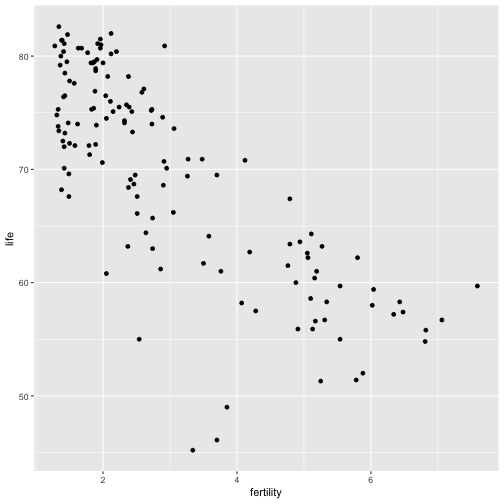
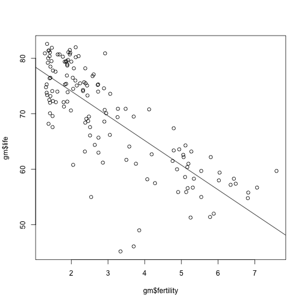
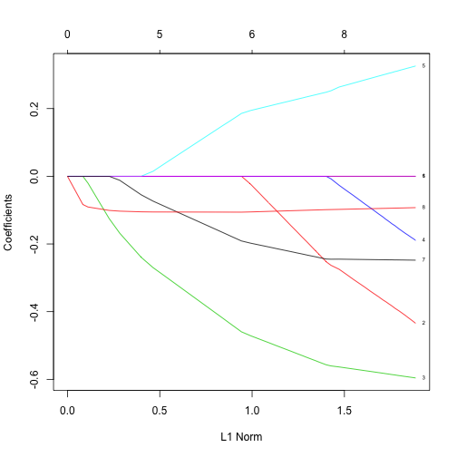

---
# Please do not edit this file directly; it is auto generated.
# Instead, please edit 04-Supervised-Learning-II.md in _episodes_rmd/
title: 'Supervised Learning II: regression'
author: "Hugo Bowne-Anderson, Jorge Perez de Acha Chavez"
teaching: 30
exercises: 10
questions: 
- "What if the target variable is numerical rather than categorical?"
objectives: 
- "Apply regression to predict continuous target variables."
- "Understand the root mean square error (RMSE) and how it relates to regression."
keypoints: 
- "Regression is a useful tool to predict numerical variables."
- "Use RMSE to measure the regression's performance."
- "Lasso regression can be used to identify key variables."
output: html_document
---

## Supervised Learning II: regression

In the classification task above, we were attempting to predict a categorical outcome, in this case 'benign' or 'malignant'. Regression, the other type of supervised learning, is one in which you're attempting to predict a continuously varying outcome, such as the price of a house or life expectancy.

~~~
gm <- read_csv("data/gapminder.csv") 
~~~
{: .language-r}

~~~
Parsed with column specification:
cols(
  population = col_integer(),
  fertility = col_double(),
  HIV = col_double(),
  CO2 = col_double(),
  BMI_male = col_double(),
  GDP = col_integer(),
  BMI_female = col_double(),
  life = col_double(),
  child_mortality = col_double()
)
~~~
{: .output}

~~~
gm %>% head()
~~~
{: .language-r}

~~~
# A tibble: 6 x 9
  population fertility   HIV   CO2 BMI_male   GDP BMI_female  life
       <int>     <dbl> <dbl> <dbl>    <dbl> <int>      <dbl> <dbl>
1   34811059      2.73   0.1  3.33     24.6 12314       130.  75.3
2   19842251      6.43   2    1.47     22.3  7103       130.  58.3
3   40381860      2.24   0.5  4.79     27.5 14646       119.  75.5
4    2975029      1.4    0.1  1.80     25.4  7383       133.  72.5
5   21370348      1.96   0.1 18.0      27.6 41312       117.  81.5
6    8331465      1.41   0.3  8.18     26.5 43952       124.  80.4
# ... with 1 more variable: child_mortality <dbl>
~~~
{: .output}

Plot life expectancy as a function of fertility:

~~~
ggplot(gm, aes(x=fertility, y=life)) + geom_point()
~~~
{: .language-r}

> ## Discussion
>
> What type of regression model might be useful for modeling the above relationship?
>
{: .discussion}

Now you'll build a linear model for the relationship between life expectancy and fertility. For more on the math of linear models, see [here](https://www.datacamp.com/community/tutorials/data-science-techniques-dataframed#linear).

~~~
mod <- lm(life~fertility, gm)
pred <- predict(mod, gm)
~~~
{: .language-r}

Plot the original data, along with the linear regression:

~~~
{plot(gm$fertility, gm$life)
abline(mod)}
~~~
{: .language-r}

> ## Discussion
>
> Many data scientists and statisticians really dig linear regression over more complex models, often citing the reason that it is interpretable: what could this mean?
>
{: .discussion}

### Compute error

What linear regression does when fitting the line to the data is it minimizes the root mean square error (RMSE). Well, it actually minimizes the mean square error but these amount to the same thing. Compute the RMSE of your linear regression model:

~~~
er <- pred - gm$life
rmse <- sqrt(mean(er^2))
rmse
~~~
{: .language-r}

~~~
[1] 5.6086
~~~
{: .output}

Now you will build a full linear regression model, using all the variables that are in the dataset:

~~~
mod_full <- lm(life~., gm)
pred_full <- predict(mod_full, gm)
er_full <- pred_full - gm$life
rmse_full <- sqrt(mean(er_full^2))
rmse_full
~~~
{: .language-r}

~~~
[1] 2.905495
~~~
{: .output}

But recall that this may not signify the RMSE on a new dataset that the model has not seen. For this reason, you'll perform a test train split and compute the RMSE:

~~~
# Set seed for reproducible results
set.seed(42)
# Train test split
inTraining <- createDataPartition(gm$life, p = .75, list=FALSE)
# Create train set
gm_train <- gm[ inTraining,]
# Create test set
gm_test <- gm[-inTraining,]
# Fit model to train set
model <- lm(life ~ ., gm_train)
# Predict on test set
p <- predict(model, gm_test)

#
er <- p - gm_test$life
rmse <- sqrt(mean(er^2))
rmse
~~~
{: .language-r}

~~~
[1] 4.024089
~~~
{: .output}

## Supervised Learning III: regularized regression

When performing linear regression, instead of minimizing the MSE, you can add other constraints that will stop the model parameters from shooting up too high. Lasso regression and ridge regression are a few examples. Your instructor will write several equations on the board to explain these constraints and all the necessary information is also in [this glmnet vignette](https://web.stanford.edu/~hastie/glmnet/glmnet_alpha.html). You'll use the glmnet package to fit a lasso regression to the data:

~~~
x = as.matrix(subset(gm, select=-life))
y = gm$life
fit = glmnet(x, y)
plot(fit, label=TRUE)
~~~
{: .language-r}

> ## Discussion
>
> Interpret the above figure. For a hint, check out [this part of Hastie & Qian's vignette](https://web.stanford.edu/~hastie/glmnet/glmnet_alpha.html#qs):
>
{: .discussion}

### Lasso regression and cross validation

The glmnet API makes k-fold cross validation pretty easy. Give it a go and find the best choice for the hyperparameter lambda:

~~~
cvfit = cv.glmnet(x, y, alph=1)
print(cvfit$lambda.min)
~~~
{: .language-r}

~~~
[1] 0.02061754
~~~
{: .output}

~~~
plot(cvfit)
~~~
{: .language-r}

### Feature selection using lasso regression

One great aspect of lasso regression is that it can be used for automatic feature selection. Once you have used k-fold CV to find the best lambda, you can look at the coefficients of each variable (for that value of lambda) and the variables with the largest coefficients are the ones to select.

~~~
x = as.matrix(subset(gm, select=-life))
y = gm$life
fit = glmnet(x, y, alpha=1)
plot(fit, label=TRUE)
~~~
{: .language-r}

> ## Discussion
>
> 1. What is the most important variable in the above?
> 2. Why would automatic variable selection be useful?
> 3. What are potential pitfalls of automatic variable selection?
>
{: .discussion}
